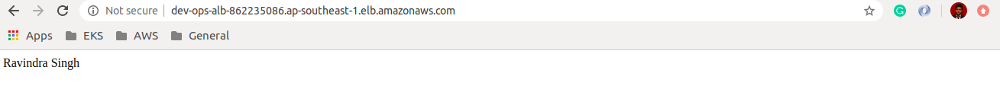

## Requirements

No requirements.

## Providers

## ALB Output:

No provider.

## Inputs

| Name | Description | Type | Default | Required |
|------|-------------|------|---------|:--------:|
| bucket\_name | n/a | `string` | `""` | no |
| env | n/a | `string` | `"dev"` | no |
| profile | n/a | `string` | `"default"` | no |
| region | n/a | `string` | `"ap-southeast-1"` | no |

## Outputs

| Name | Description |
|------|-------------|
| alb\_endpoint | n/a |
